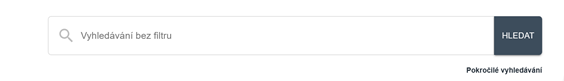
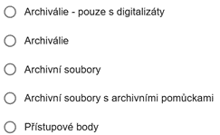
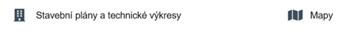

# Úvodní strana webu

## Horní lišta

Horní lišta obsahuje odkazy do jednotlivých sekcí webu:

- [:material-sitemap: Archivní soubory](../sections/section-fund.md)
- [:material-file-document-multiple: Archiválie](../sections/section-archdesc.md)
- [:material-label: Přístupové body](../sections/section-entity.md)
- [Nápověda a zkratky](../index.md)

Lze zde také přepínat jazykové mutace webu, ale přeloženy jsou jen pevné prvky (popisky) formulářů, nikoli data ani nápověda.

## Obecné vyhledávací pole

Na úvodní straně se nachází obecné vyhledávací pole pro fulltextové vyhledávání v celé databázi napříč všemi sekcemi. 
K možnostem fulltextového vyhledávání viz [Jak na webu vyhledávat](search.md).

## Přepínač

Pod obecným vyhledávacím polem je přepínač, kterým lze zúžit rozsah vyhledávání. Nabízené volby:

- **Archiválie – pouze digitalizáty**: vyhledává jen záznamy s odkazem na digitalizát uveřejněný na webu [Porta fontium](https://www.portafontium.eu). Odkazy budou postupně přibývat. Zatím je jich kolem tisíce, což je pouhý zlomek archiválií, jejichž digitalizáty jsou uveřejněny na Porta fontium.
- **Archiválie**: vyhledává mezi archiváliemi popsanými databázově.
- **Archivní soubory**: vyhledává pouze mezi archivními soubory, nejsou zahrnuty archiválie ani přístupové body.
- **Archivní soubory s archivními pomůckami**: vyhledává pouze mezi těmi archivními soubory, k nimž existuje nějaká platná archivní pomůcka.
- **Přístupové body**: vyhledává pouze mezi přístupovými body.

## Mohlo by vás zajímat

Pod přepínačem jsou předpřipravené vyhledávací dotazy na zajímavé typy archiválií (zatím pouze na technické výkresy a mapy). Ke stejnému výsledku bychom došli, kdybychom vyhledávali v sekci [:material-file-document-multiple: Archiválie](../sections/section-archdesc.md) a zaškrtli bychom ve fasetě `Druh archiválie` pole `technický výkres` nebo `mapa`. 

Až budou databázové záznamy archiválií systematicky opatřovány přístupovými body, bude možné předpřipravit další dotazy nejen podle formálních, ale také podle tematických hledisek.

## Porta fontium

V dolní části úvodní obrazovky jsou odkazy na tematické databáze s digitalizáty na webu [Porta fontium](https://www.portafontium.eu). 

