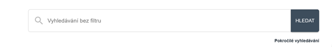
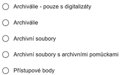
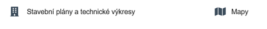

# Úvodní strana webu

## Horní lišta

Horní lišta obsahuje odkazy do jednotlivých sekcí webu:

- **[:material-sitemap: Archivní soubory](../sections/fund.md)**
- **[:material-file-document-multiple: Archiválie](../sections/archdesc.md)**
- **[:material-label: Přístupové body](../sections/entity.md)**
- **[Nápověda a zkratky](../index.md)**

Lze zde také přepínat jazykové mutace webu, ale přeloženy jsou jen pevné prvky (popisky) formulářů, nikoli data ani nápověda.

## Obecné vyhledávací pole

Na úvodní straně se nachází obecné vyhledávací pole pro fulltextové vyhledávání v celé databázi napříč všemi sekcemi. Viz [Jak na webu vyhledávat](searching.md).

## Přepínač

Pod obecným vyhledávacím polem je přepínač, kterým lze zúžit rozsah vyhledávání. Nabízené volby:

- **Archiválie – pouze digitalizáty**: vyhledává jen záznamy s odkazem na digitalizát uložený na webu [Porta fontium](https://www.portafontium.eu). Odkazy budou postupně přibývat, zatím je jich kolem tisíce, což je pouhý zlomek archiválií, jejichž digitalizáty jsou uveřejněny na Porta fontium.
- **Archiválie**: vyhledává mezi archiváliemi popsanými databázově.
- **Archivní soubory**: vyhledává pouze mezi archivními soubory, nejsou zahrnuty archiválie ani přístupové body.
- **Archivní soubory s archivními pomůckami**: vyhledává pouze mezi těmi archivními soubory, k nimž existuje nějaká platná archivní pomůcka.
- **Přístupové body**: vyhledává pouze mezi přístupovými body.

## Mohlo by vás zajímat

Předpřipravené vyhledávací dotazy na zajímavé typy archiválií (zatím pouze na technické výkresy a mapy). Ke stejnému výsledku bychom došli, kdybychom si v sekci Archiválie zaškrtli ve fasetě pole `technický výkres` nebo `mapa`. 

Až budou databázové záznamy archiválií systematicky opatřovány přístupovými body, bude možné předpřipravit další dotazy nejen podle formálních, ale také podle tematických hledisek.

## Porta fontium

Odkazy na tematické databáze s digitalizáty na webu [Porta fontium](https://www.portafontium.eu). 

