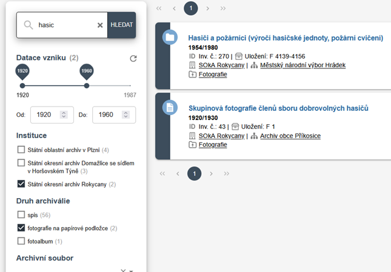

# Jak na webu vyhledávat

## Fulltextové vyhledávání

Fulltext nerozlišuje velká a malá písmena a ignoruje diakritiku. Pokud chceme vyhledat archiválie vztahující se k lyžařům, stačí zadat např. `lyzar`.

Vyhledávač neumí pracovat s různými koncovkami slov. Pokud zadáme `lyžařský`, nenajdou se záznamy obsahující výraz `lyžařské`. Vhodnější je text zkrátit, např. `lyzarsk` nebo `lyzar`.

Pro víceslovné řetězce platí, že **první slova musí být zadána celá** a pouze poslední slovo lze zkrátit. Například dotaz `hasicska zbrojn` vyhledá záznamy o hasičských zbrojnicích, zatímco `hasic zbrojn` nenajde nic.

Platforma ARON se dále vyvíjí a v nejbližší době bude věnována zvýšená pozornost vyhledávání, což povede k výraznému zlepšení jeho schopností.
 
## Filtrování výsledků

Výsledky vyhledávání je možné zpřesnit pomocí filtrů, které se liší podle jednotlivých sekcí 
([:material-sitemap: Archivní soubory](../sections/section-fund.md), [:material-file-document-multiple: Archiválie](../sections/section-archdesc.md) nebo [:material-label: Přístupové body](../sections/section-entity.md)). 
Filtry lze kombinovat a vždy se zobrazí jen záznamy splňující všechny zadané podmínky.

## Řazení výsledků

Výsledky jsou v současnosti řazeny pouze podle relevance. Nejprve se zobrazují záznamy, kde se hledaný výraz nachází v názvu, až poté záznamy s&nbsp;výskytem v&nbsp;jiných polích.

Do budoucna se počítá i s možností řazení podle dalších kritérií (např. datace vzniku).

## Hledání podle přístupových bodů

Další možností je vyhledávání pomocí přístupových bodů (entit). Ty fungují podobně jako klíčová slova, lze najít všechny archiválie napojené na stejnou entitu. Tento způsob vyhledávání bude hrát větší roli spíše až v budoucnu, kdy bude více záznamů opatřeno přístupovými body. Viz též [:material-label: Přístupové body](../sections/section-entity.md).

*[ARON]: ARchiv ONline