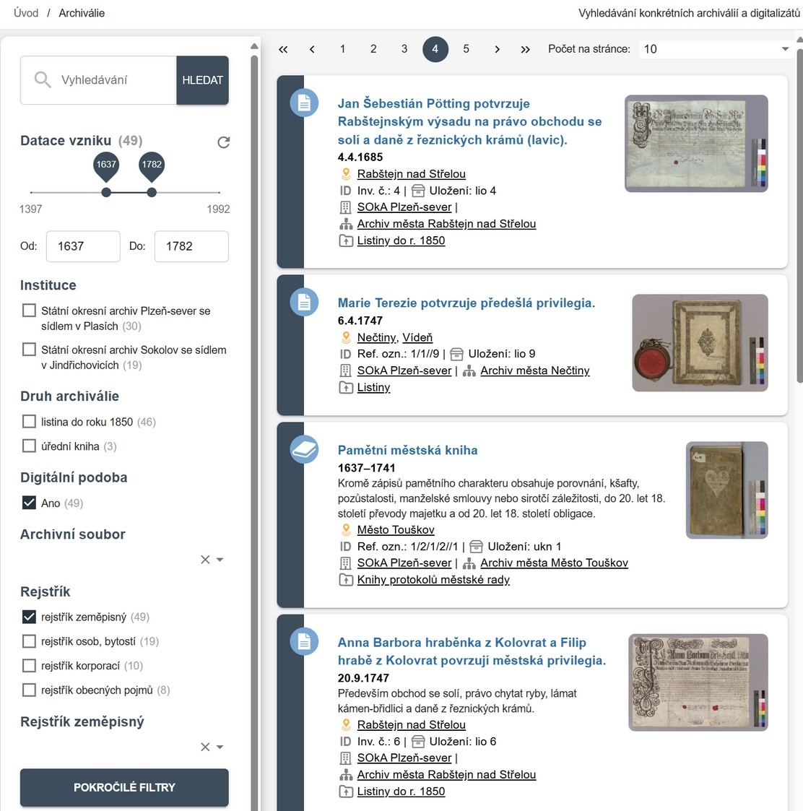
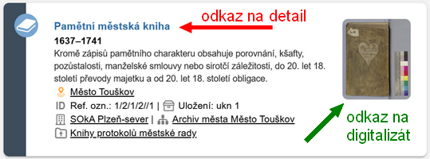
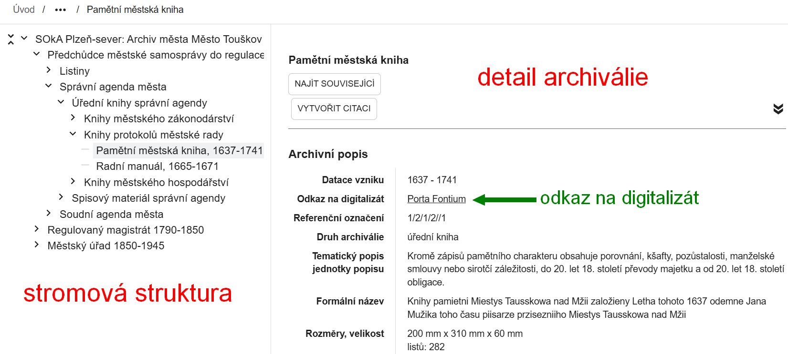

---
icon: material/file-document-multiple
title: Archiválie
---
# Sekce Archiválie

V sekci **:material-file-document-multiple: Archiválie** lze vyhledávat jednotlivé archiválie i celé skupiny archiválií. Zobrazují se pouze záznamy, které mají databázový popis vytvořený v systému ELZA nebo přepsaný ze starších pomůcek.

## Úrovně popisu

Archiválie jsou uspořádány hierarchicky:

1.  **Kořen archivního souboru** – zde bývá podrobný popis celého archivního souboru.
2.  **Série** – tematické celky, odpovídají nadpisům ve starších inventárních seznamech.
3.  **Složka** – obsahuje více archiválií, např. karton, spis, někdy také odpovídá nadpisu ve starších inventárních seznamech.
4.  **Jednotlivost** – jednotlivé archiválie, např.  úřední knihy a rukopisy,  mapy a plány, fotografie, listiny...
5.  **Část jednotlivosti** – např. zápis v knize, pečeť, díl mapy...

Archivní soubor lze procházet ve [stromové struktuře](#zobrazeni-ve-stromove-strukture).

## Vyhledávání archiválií

V levém panelu lze vyhledávat pomocí fulltextu i filtrů:

- **Obecné vyhledávací pole** `Vyhledávání` – hledá fulltextově v názvech i v popisu, viz [Jak na webu vyhledávat](../help/search.md).
- **Datace vzniku** – zobrazuje celkový časový rozsah všech vyhledaných archiválií. Po úpravě hodnoty filtru se zobrazí jen ty archiválie, jejichž vznik spadá do upraveného rozsahu.
- **Instituce** – filtr podle archivů, lze kombinovat více institucí. Řazení institucí ve filtru je podle aktuálního počtu výsledků (počet je uveden v závorce u každé instituce).
- **Druh archiválie** – spisy (složky) nebo jednotlivosti (např. knihy, mapy, technické výkresy). Druhy archiválií jsou ve filtru řazeny podle aktuálního počtu výsledků (počet je uveden v závorce u každé položky).
- **Digitální podoba** – vyhledá jen archiválie s odkazem na digitální reprodukce. Klikutím na symbol  vpravo nebo na náhled snímku vpravo přejdete na digitalizovanou archiválii zveřejněnou na webu [Porta fontium](https://www.portafontium.eu).
- **Archivní soubor** – omezí vyhledávání jen na vybraný archivní soubor. Do pole se zadává název archivního souboru. Je nutné vybrat některý ze souborů nabízených v našeptávači. Tento filtr je též aktivován dlaždicí **:material-magnify: Vyhledat archiválie v archivním souboru** v detailu archivního souboru, viz [:material-sitemap: Archivní soubory](section-fund.md#detail-archivniho-souboru).
- **Úroveň popisu** – umožňuje omezit vyhledávání na jednotlivé archiválie a fyzické složky se spisy nebo naopak na větší skupiny archiválií sdružené do větších sérií archiválií nebo celého archivního souboru – `archiválie` = složky + jednotlivosti + části jednotlivostí; `série archiválií` = kořeny archivních souborů + série. V&nbsp;pokročilých filtrech naleznete filtr `Úroveň popisu (podrobný výběr)`, s&nbsp;jehož pomocí lze třídit archiválie podle jakékoli úrovně (kořen archivního souboru, série, složka, jednotlivost, část jednotlivosti).
- **Rejstřík** – filtr podle přístupových bodů, po zaškrtnutí druhu rejstříku je možné použít pole s našeptávačem, které se zobrazí dole. Napojování přístupových bodů je teprve v začátcích, takže filtr nenajde všechny relevantní záznamy, viz [:material-label: Přístupové body](section-entity.md).
- **Pokročilé filtry** – možnost vyhledávání i podle dalších kritérií. Filtry jsou předmětem dalšího vývoje, postupně se budou zdokonalovat.

## Zobrazení ve stromové struktuře

Při otevření detailu archiválie 

se vlevo zobrazí stromová struktura archivního souboru. Pomocí ní lze přecházet mezi jednotlivými záznamy.

Do stejné struktury se dostanete i ze sekce [:material-sitemap: Archivní soubory](section-fund.md#detail-archivniho-souboru) kliknutím na dlaždici **:material-file-tree: Seznam archiválií v archivním souboru**.

