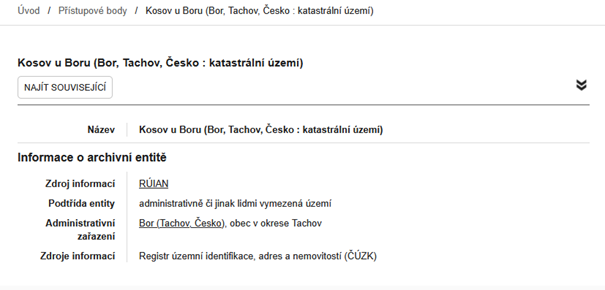

# Sekce Přístupové body

Přístupové body fungují jako jednotný rejstřík entit, které mají vztah k archiváliím. 

Archiváři vytvářejí archivní autoritní záznamy (jinak též „záznamy entit“), které pak propojují s&nbsp;popisem archiválií, čímž vznikají přístupové body. Díky tomu bude možné dohledat všechny záznamy vztahující se k&nbsp;jedné osobě, organizaci, místu, události nebo pojmu.

Většina záznamů archiválií dosud **není přístupovými body opatřena**, takže výsledky vyhledávání s&nbsp;pomocí přístupových bodů jsou neúplné. Systematické vytváření přístupových bodů je pro archivy do budoucna velkým a časově velmi náročným úkolem.

Blíže k&nbsp;pojmům jako „entita“, „archivní autoritní záznam“, „přístupový bod“ viz [Vysvětlivky a pojmy](../help/glossary.md#pojmy).

Rozlišujeme sedm základních tříd entit:

  
  
korporace

  
  
osoba / bytost

  
  
rod / rodina

  
  
geografický objekt

  
  
událost

  
  
dílo / výtvor

  
  
obecný pojem

## Vyhledávání přístupových bodů

Vyhledávat lze pomocí obecného vyhledávacího pole nebo filtrů, lze je kombinovat:

- **Obecné vyhledávací pole**  `Vyhledávání` – hledá fulltextově v&nbsp;názvech i v&nbsp;popisech entit. K&nbsp;fulltextovému vyhledávání viz [Jak na webu vyhledávat](../help/search.md).
- **Třída entity** – výběr jedné ze sedmi základních tříd.
- **Podtřída entity** – další zpřesnění vybraných tříd, podtřídy se ve filtru řadí podle počtu výskytů (počet se zobrazuje v závorce).
- **Pokročilé filtry** – možnost vyhledávání i podle dalších kritérií. Filtry jsou předmětem dalšího vývoje, postupně se budou zdokonalovat.

## Zobrazení záznamů entit

Po kliknutí na nalezený záznam se otevře detail entity. V detailu je možné tlačítkem **NAJÍT SOUVISEJÍCÍ** zobrazit archiválie a archivní soubory, které jsou se záznamem propojeny. Jelikož většina archiválií dosud není přístupovými body opatřena, počet takto zobrazených archiválií bude neúplný.

*[entit]: jakýchkoli objektů popisovaných formou archivního autoritního záznamu za účelem tvorby přístupových bodů a rejstříků
*[autoritní záznamy]: standardizovaný popis entit za účelem tvorby přístupových bodů a rejstříků
*[přístupové body]: archivní autoritní záznamy připojené k jednotkám popisu za účelem vyhledávání, identifikace, lokalizace a pro tvorbu rejstříkových hesel