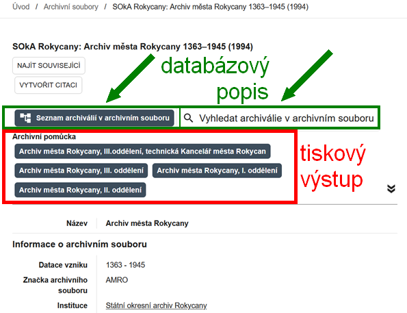
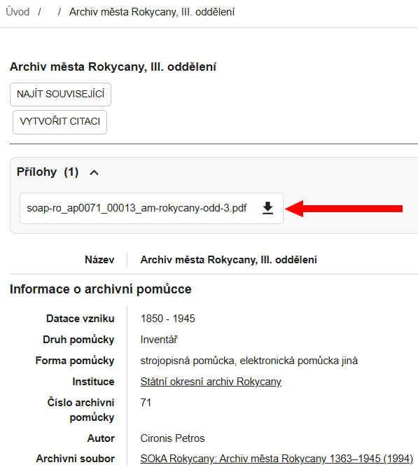

# Sekce Archivní soubory

V sekci **:material-sitemap: Archivní soubory** lze vyhledávat a prohlížet popisy všech více než 17&nbsp;000 archivních fondů a sbírek uložených ve Státním oblastním archivu v Plzni včetně státních okresních archivů z Plzeňského a Karlovarského kraje. Vyhledávání zahrnuje základní údaje o archivních souborech i o připojených archivních pomůckách.

## Vyhledávání archivních souborů

V levém panelu můžete kombinovat fulltextové vyhledávání a filtry:

- **Obecné vyhledávací pole** `Vyhledávání` – fulltextové vyhledávání v informacích o archivních souborech a o archivních pomůckách – viz [Jak na webu vyhledávat](../help/search.md). Fulltextové vyhledávání zde **neprohledává obsah pomůcek**, tedy ani seznam archiválií. Toho lze docílit hromadně jen v&nbsp;sekci [:material-file-document-multiple: Archiválie](section-archdesc.md) nebo v&nbsp;jednotlivých archivních pomůckách – podrobněji v kapitole [Archivní pomůcky](#archivni-pomucky).
- **Název archivního souboru** – vyhledává v názvech, značkách a číslech archivních souborů (např. „Velkostatek Žinkovy“, značka „Vs Žinkovy“, číslo „20143“).
- **Datace vzniku** – pokud zúžíme časový rozsah, zobrazí se jen ty archivní soubory, které obsahují alespoň jednu archiválii spadající do uvedeného rozsahu.
- **Místo vzniku** – obvykle sídlo původce, případně více míst, pokud původce sídlo měnil nebo bylo více původců s různými sídly.
- **Archivní popis** – zobrazí jen soubory s databázovým popisem – viz [Databázový archivní popis](#databazovy-archivni-popis).
- **Pomůcka** – zobrazí jen soubory s archivními pomůckami (téměř všechny jsou na webu dostupné, buď databázově, nebo v PDF, nebo naskenované).
- **Instituce** – filtrování podle archivu, který má archivní soubor v péči.
- **Oddělení** – archivní soubory centrály lze filtrovat podle příslušnosti k oddělením.
- **Původce** – filtrování podle napojených přístupových bodů původců. Stačí začít psát jméno původce a objeví se našeptávač, který ale v&nbsp;jednom okamžiku nabízí jen 10 záznamů. Pokud tedy napíšeme do okna například slovo „Plzeň“, nabídka nebude dostatečná. Dotaz je pak třeba zúžit přidáním dalších znaků. Našeptávač nezohledňuje variantní názvy původců (např. německé názvy). Vylepšení tohoto filtru je předmětem dalšího vývoje.
- **Tematická skupina** – filtrování podle tematického zařazení archivních souborů. Pořadí nabízených tematických skupin je podle aktuálně zobrazeného počtu výsledků pro danou skupinu.
- **Pokročilé filtry** – možnost filtrování i podle dalších kritérií.

Výsledky vyhledávání se zobrazují v&nbsp;pravém panelu. 

## Detail archivního souboru

Po kliknutí na vyhledaný záznam 

se otevře detail archivního souboru s&nbsp;podrobnějšími údaji o&nbsp;archivním souboru.
Pokud je archivní soubor nebo jeho část opatřena databázovým archivním popisem, zobrazí se nahoře dlaždice: 

**:material-file-tree: Seznam archiválií v archivním souboru** &nbsp; **:material-magnify: Vyhledat archiválie v archivním souboru** 

Pomocí těchto dlaždic lze přejít na **databázový popis** tohoto konkrétního archivního souboru, blíže viz

* [:material-file-document-multiple: Archiválie – zobrazení ve stromové struktuře](section-archdesc.md#zobrazeni-ve-stromove-strukture), 

* [:material-file-document-multiple: Archiválie – vyhledávání archiválií](section-archdesc.md#vyhledavani-archivalii).

Pokud je k archivnímu souboru nebo jeho části vydána alespoň jedna schválená archivní pomůcka, zobrazí se pod nadpisem **Archivní pomůcka** jedna nebo více dlaždic. Po kliknutí na dlaždici se zobrazí detail archivní pomůcky a obvykle i její obsah – **tiskový výstup** archivní pomůcky ve formátu PDF nebo naskenované strojopisné stránky.

## Archivní pomůcky

Více než 6&nbsp;000 z celkových 17&nbsp;000 archivních souborů je opatřeno archivními pomůckami. 
Ty mohou být ve třech formách:

1. [naskenované strojopisy](#naskenovane-strojopisy),
2. [soubory ve formátu PDF](#soubory-ve-formatu-pdf),
3. [databázový archivní popis](#databazovy-archivni-popis).

### Naskenované strojopisy

Starší strojopisné pomůcky jsou dostupné jako naskenované obrázky. Fulltextové vyhledávání zatím není k dispozici, některé pomůcky však na konci obsahují rejstřík.

Po kliknutí na dlaždici pod nadpisem **Archivní pomůcka** se zobrazí detail archivní pomůcky včetně naskenovaných snímků. 

### Soubory ve formátu PDF

Pomůcky vytvořené elektronicky v textovém editoru nebo v databázovém systému lze stahovat a fulltextově prohledávat.

Po kliknutí na dlaždici s názvem archivní pomůcky pod nadpisem **Archivní pomůcka** se zobrazí detail archivní pomůcky. 

V detailu archivní pomůcky se pod nadpisem **Přílohy** zobrazí dlaždice se souborem ke stažení. 

### Databázový archivní popis

U archivních souborů zpracovaných v systému ELZA nebo u starších pomůcek přepsaných do databáze ELZA 
je k&nbsp;dispozici tiskový výstup ke stažení ve formátu PDF nebo naskenované snímky starší pomůcky – stejně jako u ostatních archivních pomůcek.

Navíc je v detailu **archivního souboru** možné:

* procházet archivní soubor ve stromové struktuře po kliknutí na dlaždici **:material-file-tree: Seznam archiválií v archivním souboru**, viz [:material-file-document-multiple: Archiválie – zobrazení ve stromové struktuře](section-archdesc.md#zobrazeni-ve-stromove-strukture), 

* vyhledávat archiválie fulltextem a pomocí filtrů po kliknutí na dlaždici **:material-magnify: Vyhledat archiválie v archivním souboru**, viz [:material-file-document-multiple: Archiválie – vyhledávání archiválií](section-archdesc.md#vyhledavani-archivalii).

