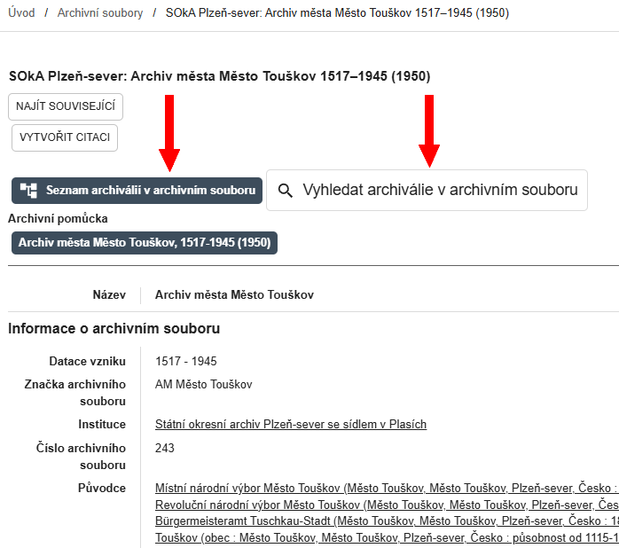

# Sekce Archivní soubory

V sekci **:material-sitemap: Archivní soubory** lze vyhledávat a prohlížet popisy všech všech více než 17 000 archivních fondů a sbírek uložených ve Státním oblastním archivu v Plzni včetně státních okresních archivů z Plzeňského a Karlovarského kraje. Vyhledávání zahrnuje základní údaje o archivních souborech i o připojených archivních pomůckách.

## Vyhledávání archivních souborů

V levém panelu můžete kombinovat fulltextové vyhledávání a filtry:

- **Obecné vyhledávací pole**: fulltextové vyhledávání v informacích o archivních souborech a o archivních pomůckách – viz [Jak na webu vyhledávat](../help/searching.md). Fulltextové vyhledávání zde **neprohledává obsah pomůcek**, tedy ani seznam archiválií, toho lze docílit hromadně jen v&nbsp;sekci Archiválie nebo v&nbsp;jednotlivých archivních pomůckách po rozkliknutí detailu jednotlivých archivních souborů – podrobněji v kapitole [Archivní pomůcky](#archivni-pomucky).
- **Název archivního souboru**: vyhledává v názvech, značkách a číslech archivních souborů (např. „Velkostatek Žinkovy“, značka „Vs Žinkovy“, číslo „20143“).
- **Datace vzniku**: pokud zúžíme časový rozsah, zobrazí se jen ty archivní soubory, které obsahují alespoň jednu archiválii spadající do uvedeného rozsahu.
- **Místo vzniku**: obvykle sídlo původce, případně více míst, pokud původce sídlo měnil.
- **Archivní popis**: zobrazí jen soubory s databázovým popisem – viz [Databázový archivní popis](#databazovy-archivni-popis).
- **Pomůcka**: zobrazí jen soubory s archivními pomůckami (téměř všechny jsou na webu dostupné, buď databázově, nebo v PDF, nebo naskenované).
- **Instituce**: filtrování podle archivu, který má archivní soubor v péči.
- **Oddělení**: archivní soubory centrály lze filtrovat podle příslušnosti k oddělením.
- **Původce**: filtrování podle napojených přístupových bodů původců. Stačí začít psát jméno původce a objeví se našeptávač, který ale v&nbsp;jednom okamžiku nabízí jen 10 záznamů. Pokud tedy napíšeme do okna například slovo „Plzeň“, nabídka nebude dostatečná. Dotaz je pak třeba zúžit přidáním dalších znaků. Našeptávač nezohledňuje variantní názvy původců (např. německé názvy). Vylepšení tohoto filtru je předmětem dalšího vývoje.
- **Tematická skupina**: filtrování podle tematického zařazení archivních souborů. Pořadí nabízených tematických skupin je podle aktuálně zobrazeného počtu výsledků pro danou skupinu.
- **Pokročilé filtry**: možnost filtrování i podle dalších kritérií.

Výsledky vyhledávání se zobrazují v&nbsp;pravém panelu. 

## Detail archivního souboru

Po kliknutí na vyhledaný záznam se otevře detail archivního souboru s&nbsp;podrobnějšími údaji a s&nbsp;odkazy na související archivní pomůcky v&nbsp;podobě dlaždic nahoře pod nadpisem **Archivní pomůcka**. 

Po kliknutí na dlaždici pod nadpisem **Archivní pomůcka** se zobrazí detail s informacemi o archivní pomůcce a obvykle také její vyhotovení v&nbsp;elektronické podobě ve formátu PDF nebo ve formě naskenovaných stránek strojopisné archivní pomůcky.

## Archivní pomůcky

Více než 6&nbsp;000 z celkových 17&nbsp;000 archivních souborů je opatřeno archivními pomůckami. 
Ty mohou být ve třech formách:

1. [naskenované strojopisy](#naskenovane-strojopisy),
2. [soubory ve formátu PDF](#soubory-ve-formatu-pdf),
3. [databázový archivní popis](#databazovy-archivni-popis).

### Naskenované strojopisy

Obvykle starší pomůcky vytvořené na psacím stroji, dostupné jsou jako obrázky. Zatím je nelze fulltextově prohledávat, ale mohou být vzadu opatřeny rejstříkem.

Po kliknutí na dlaždici pod nadpisem **Archivní pomůcka** se zobrazí detail archivní pomůcky včetně snímků naskenované archivní pomůcky. 

### Soubory ve formátu PDF

Pomůcky pořízené elektronicky v textovém editoru nebo v databázovém systému. Archivní pomůcky ve formátu PDF lze stahovat a prohledávat fulltextem.

Po kliknutí na dlaždici s názvem archivní pomůcky pod nadpisem **Archivní pomůcka** se zobrazí detail archivní pomůcky. 

V detailu archivní pomůcky se pod nadpisem **Přílohy** objeví dlaždice se souborem ke stažení. 

### Databázový archivní popis

Po kliknutí na dlaždici s názvem archivní pomůcky pod nadpisem **Archivní pomůcka** se zobrazí detail archivní pomůcky. Stejně jako u ostatních archviních pomůcek může obsahovat tiskový výstup ke stažení ve formátu PDF nebo snímky naskenované starší pomůcky. 

U archivních souborů zpracovaných v systému ELZA nebo u starších pomůcek přepsaných do databáze ELZA je navíc v detailu **archivního souboru** možné:

* procházet archivní soubor ve stromové struktuře po kliknutí na dlaždici **:material-file-tree: Seznam archiválií v archivním souboru**.

* vyhledávat archiválie fulltextem a pomocí filtrů po kliknutí na dlaždici **:material-magnify: Vyhledat archiválie v archivním souboru**

Podrobněji viz [:material-file-document-multiple: Archiválie](section-archdesc.md).

