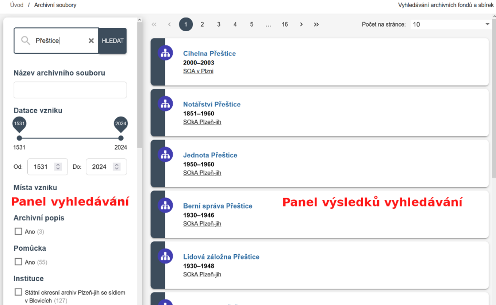
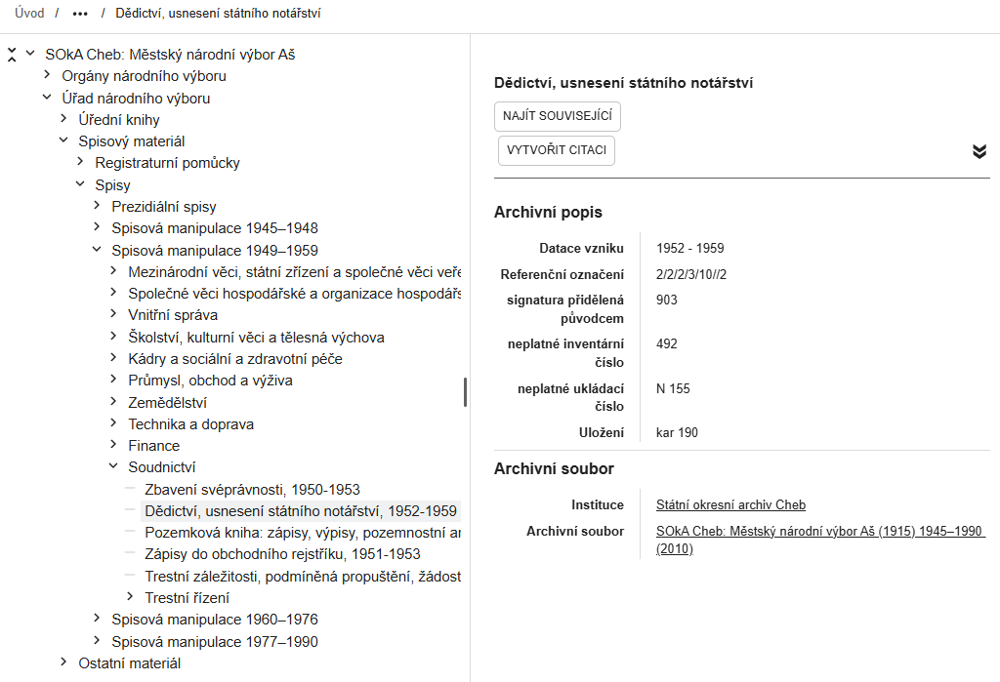

# Společné prvky sekcí

Sekce [:material-sitemap: Archivní soubory](section-fund.md), [:material-file-document-multiple: Archiválie](section-archdesc.md) a [:material-label: Přístupové body](section-entity.md) mají společné uspořádání obrazovky:

## Panel vyhledávání

V levém panelu se nachází:

- **Fulltextové vyhledávací pole**
- **Filtry** přizpůsobené jednotlivým sekcím (např. datace, druh archiválie, třída entity)

Díky kombinaci filtrů lze dotazy přesně zacílit. Viz [Jak na webu vyhledávat](../help/searching.md).

## Panel výsledků vyhledávání

V pravé části se zobrazují výsledky vyhledávání. Maximální počet zobrazených záznamů je 9&nbsp;999.

Výsledky jsou řazeny podle relevance, nejprve záznamy, kde se hledaný text nachází v názvu, poté záznamy s výskytem v jiných polích. Jiné řazení zatím není možné.

## Zobrazení záznamu

Kliknutím na záznam se otevře detailní zobrazení. Obsahuje všechny dostupné informace, tedy i ty, které se nezobrazují v&nbsp;přehledu výsledků.

- V sekcích [:material-sitemap: Archivní soubory](section-fund.md) a [:material-label: Přístupové body](section-entity.md) se záznam zobrazuje v jednom panelu.
- V sekci [:material-file-document-multiple: Archiválie](section-archdesc.md) je doplněn ještě levý panel se stromovou strukturou celého archivního souboru, což umožňuje přecházet mezi souvisejícími záznamy.

